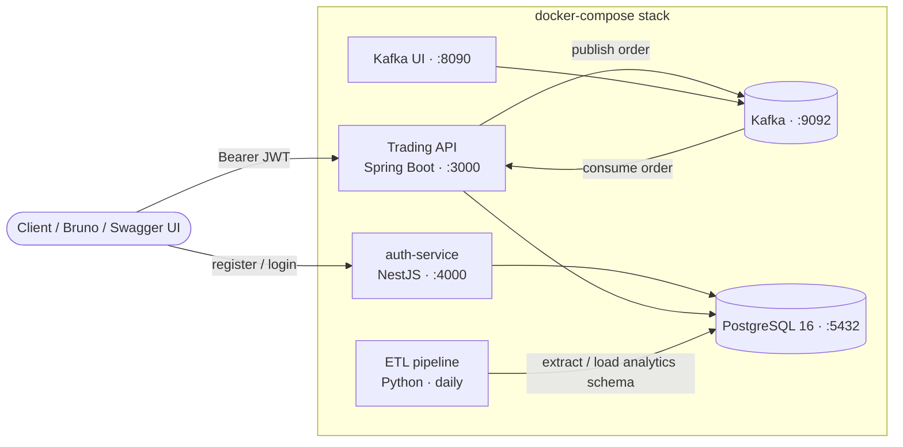

# TNS Capital — Enterprise Trading Platform

A backend trading platform built for the Neueda Leap Program 2026. It manages trading
accounts, instruments, orders and positions, and processes orders asynchronously through
Kafka with a dead-letter queue for failures. A separate auth service issues the JWTs the
trading API trusts, and a scheduled ETL pipeline copies trade data into reporting tables.

---

## Contents

- [Architecture](#architecture)
- [Tech stack](#tech-stack)
- [Repository layout](#repository-layout)
- [Getting started](#getting-started)
- [Using the API](#using-the-api)
- [Developing locally](#developing-locally)
- [Testing](#testing)
- [CI/CD pipeline](#cicd-pipeline)
- [Troubleshooting](#troubleshooting)
- [Further documentation](#further-documentation)
- [Contributing](#contributing)
- [Team](#team)

---

## Architecture



| Component | Responsibility |
|---|---|
| **Trading API** (`src/`) | REST API for accounts, instruments, orders, positions and the DLQ. Validates JWTs locally using a shared HMAC secret. |
| **Auth service** (`shared/auth-service/`) | Registers users (opening a trading account for each), logs them in and issues access and refresh tokens. Passwords are hashed with Argon2id; refresh tokens are stored only as SHA-256 hashes in `refresh_tokens`. |
| **Kafka** | Carries order events (`orders`) and trade lifecycle events (`trade-events`), each with a `.dlq` topic. The API creates the topics on startup. |
| **PostgreSQL** | System of record. The `db/` image creates the schema, views and seed data on first start. |
| **ETL** (`etl/`) | Extracts trades every day, transforms them into a star schema and loads them into the `analytics` schema. |

### Order lifecycle

1. `POST /api/v1/orders` checks that the caller owns the account and that the account and
   instrument exist, then publishes an `OrderEvent` to the `orders` topic (keyed by account
   ID, so orders for one account are processed in sequence) and returns **`202 Accepted`**
   with an `orderId`.
2. `OrderMessageListener` consumes the event and runs the order through `OrderValidator` and
   the matching execution strategy (`BuyOrderStrategy` / `SellOrderStrategy`), which update
   the cash balance and position.
3. A successful order is saved as `FILLED` and a trade event is published to `trade-events`.
4. A failed order (insufficient funds or holdings, inactive account, etc.) is saved as
   `REJECTED` with a reason and captured in the dead-letter queue (`dlq_messages` table and
   `orders.dlq` topic). Admins can inspect and replay these messages through
   `/api/v1/dlq`.
5. Clients poll `GET /api/v1/orders/{orderId}` to see the final status.

Order statuses: `NEW`, `FILLED`, `REJECTED`, `CANCELLED`.

---

## Tech stack

| Area | Technology |
|---|---|
| Trading API | Java 17+ (built and run on JDK 21), Spring Boot 3.5, Spring Security (OAuth2 resource server), Spring Data JPA, MyBatis, Spring Kafka, springdoc-openapi |
| Auth service | Node.js 20, NestJS 11, TypeScript, Argon2, `pg` |
| Messaging | Apache Kafka 7.5 (Confluent) with ZooKeeper, Kafka UI |
| Database | PostgreSQL 16 |
| ETL | Python 3.12, pandas, psycopg2, schedule |
| Testing | JUnit 5, Mockito, Testcontainers, JaCoCo, Jest, Supertest, pytest |
| CI/CD and quality | Jenkins, SonarQube, Gitleaks, Semgrep, Trivy |
| Containers | Docker, Docker Compose |

---

## Repository layout

```
TNS-Capital/
├── src/main/java/com/neueda/leap/   Trading API (Spring Boot)
│   ├── controllers/                 REST endpoints and the global exception handler
│   ├── services/                    Business logic: orders, accounts, order validation, DLQ
│   ├── strategies/                  Buy and sell execution strategies
│   ├── kafka/                       Order/trade event publishers, order listener, event types
│   ├── security/                    JWT configuration and account ownership checks
│   ├── model/  dtos/  enums/        JPA entities, request/response records, enums
│   ├── repositories/  mappers/      Spring Data JPA repositories and MyBatis mappers
│   ├── exceptions/                  Domain exceptions mapped to API error codes
│   └── config/                      Kafka, OpenAPI and MyBatis configuration
├── src/test/                        Unit tests and *IT integration tests (Testcontainers)
├── shared/auth-service/             NestJS auth service (has its own README)
├── db/                              PostgreSQL image: tables/, views/, seed data/
├── etl/                             Python ETL pipeline (has its own README)
├── bruno/                           Bruno API collection for manual testing
├── contracts/                       OpenAPI contract for the auth API
├── docs/                            Business logic, security guide, SonarQube, diagrams
├── docker-compose.yml               Full local stack
├── Dockerfile                       Multi-stage build for the trading API
├── Jenkinsfile                      CI pipeline
└── .env.example                     Template for required secrets
```

---

## Getting started

These steps take a fresh clone to a running stack.

### Prerequisites

| Tool | Version | Needed for |
|---|---|---|
| [Git](https://git-scm.com/) | any recent | cloning the repo |
| [Docker](https://docs.docker.com/get-docker/) with Docker Compose | Docker 24+ | running the stack and the integration tests |
| JDK | 21 (17 minimum) | building and testing the API outside Docker (optional) |
| Maven | 3.8+ | as above (optional) |
| Node.js | 20+ | developing the auth service (optional) |
| Python | 3.12 | developing the ETL pipeline (optional) |

The full stack uses about 3.5 GB of memory. Give Docker Desktop at least 4 GB.

> The commands below use `docker compose` (Compose v2). If you have the older standalone
> tool, use `docker-compose` instead; the arguments are the same.

### 1. Clone the repository

```bash
git clone https://github.com/NathanCarr10/TNS-Capital.git
cd TNS-Capital
```

### 2. Create your `.env` file

No secrets are committed, and the stack refuses to start without them.

```bash
cp .env.example .env
```

Edit `.env` and set:

| Variable | Description |
|---|---|
| `DB_USER` | PostgreSQL user. The default `tns-capital-db-user` is fine. |
| `DB_PASSWORD` | Any password for the local database. |
| `JWT_SECRET` | Shared secret used by the auth service to sign tokens and by the API to verify them. Must be at least 32 bytes. Generate one with `openssl rand -hex 32`. |
| `JWT_REFRESH_SECRET` | Reserved for the auth service and never given to the API. Nothing reads it yet (refresh tokens are random values stored as hashes), but set it to a different random value with `openssl rand -hex 32`. |

Optional: `ETL_SCHEDULE_TIME` (default `02:00`) and `KAFKA_UI_PORT` (default `8090`).

### 3. Start the stack

```bash
docker compose up -d --build
```

The first build downloads base images and Maven/npm dependencies, so it takes a few
minutes. Compose starts the services in order: ZooKeeper and Kafka, then PostgreSQL (which
creates the schema and seed data), then the auth service, then the trading API.

Check that everything is up:

```bash
docker compose ps
```

All services should show `running` (and `healthy` where a health check exists). Follow the
API's startup with `docker compose logs -f app`.

### 4. Services and ports

| Service | URL | Notes |
|---|---|---|
| Trading API | http://localhost:3000 | All endpoints need a bearer token |
| Swagger UI | http://localhost:3000/swagger-ui.html | Public. Click **Authorize** and paste an access token |
| OpenAPI spec | http://localhost:3000/v3/api-docs | Public |
| Auth service | http://localhost:4000 | `GET /health` is public |
| Kafka UI | http://localhost:8090 | Browse topics and messages |
| PostgreSQL | `localhost:5432`, database `tns_capital` | Credentials from `.env` |
| Kafka | `kafka:9092` | Reachable from inside the Compose network (see [Troubleshooting](#troubleshooting)) |

### 5. Verify it works

```bash
# Auth service is up
curl http://localhost:4000/health
# -> {"status":"up"}

# Log in as the seeded admin and keep the access token
TOKEN=$(curl -s -X POST http://localhost:4000/auth/login \
  -H "Content-Type: application/json" \
  -d '{"username":"admin","password":"adminPassword"}' \
  | python3 -c 'import sys, json; print(json.load(sys.stdin)["accessToken"])')

# Trading API health (needs a token)
curl -s http://localhost:3000/actuator/health -H "Authorization: Bearer $TOKEN"
# -> {"status":"UP", ...}

# Read a seeded account's balance
curl -s http://localhost:3000/api/v1/accounts/1/balance -H "Authorization: Bearer $TOKEN"
# -> {"balance":5000.00}
```

### Stopping and resetting

```bash
docker compose down        # stop the stack, keep the database
docker compose down -v     # stop the stack and delete the database volume
```

The database scripts in `db/` only run when the data volume is empty. **After pulling
changes to `db/tables` or `db/data`, run `docker compose down -v` and start again** so
PostgreSQL rebuilds the schema.

---

## Using the API

### Authentication

Every trading API endpoint except Swagger needs an access token from the auth service:

```
Authorization: Bearer <accessToken>
```

Login returns an access token, valid for 15 minutes, and a refresh token, valid for 7 days.
When the access token expires, send the refresh token to `POST /auth/refresh` to get a new
pair. Each refresh token works once: reusing a spent one ends that login session. A user can
be logged in on several devices at once. See
[shared/auth-service/README.md](shared/auth-service/README.md) for the token claims, refresh
and logout.

| User | Password | Role | Access |
|---|---|---|---|
| `admin` (seeded) | `adminPassword` | `ADMIN` | Every account, opening accounts, the DLQ |
| A user you register | your own | `USER` | Only the account opened at registration |

The seeded users `alice` and `bob` have placeholder password hashes and cannot log in.
Register your own user instead.

### Example: register, fund and trade

```bash
# 1. Register a user; this also opens a trading account with a zero balance
curl -s -X POST http://localhost:4000/auth/register \
  -H "Content-Type: application/json" \
  -d '{"username":"trader1","password":"password123","holderName":"Ada Lovelace"}'
# -> {"id":4,"username":"trader1",...,"accountId":11,"accountNumber":"ACC-U000004"}

# 2. Log in
TOKEN=$(curl -s -X POST http://localhost:4000/auth/login \
  -H "Content-Type: application/json" \
  -d '{"username":"trader1","password":"password123"}' \
  | python3 -c 'import sys, json; print(json.load(sys.stdin)["accessToken"])')

# 3. Deposit cash (use the accountId from step 1)
curl -s -X POST http://localhost:3000/api/v1/accounts/11/deposit \
  -H "Authorization: Bearer $TOKEN" -H "Content-Type: application/json" \
  -d '{"amount": 5000.00}'

# 4. Place a buy order; returns 202 with an orderId
curl -s -X POST http://localhost:3000/api/v1/orders \
  -H "Authorization: Bearer $TOKEN" -H "Content-Type: application/json" \
  -d '{"accountId":11,"symbol":"ACME","side":"BUY","quantity":10,"price":100.00,
       "idempotencyKey":"'"$(uuidgen)"'"}'

# 5. Poll the order until it is FILLED or REJECTED
#    (a 404 straight after placing it means the consumer has not processed it yet)
curl -s http://localhost:3000/api/v1/orders/<orderId> -H "Authorization: Bearer $TOKEN"

# 6. See the resulting position
curl -s http://localhost:3000/api/v1/accounts/11/positions -H "Authorization: Bearer $TOKEN"
```

Seeded tradable symbols include `ACME`, `TECH`, `GOOG`, `APPL`, `MSFT`, `GOLD`, `BOND1`,
`UTIL` and `HEMP` (`GLOB` is seeded as not tradable).

### Endpoint overview

All paths are under `/api/v1`. Swagger UI documents the request and response bodies.

| Resource | Endpoints |
|---|---|
| Accounts | `GET /accounts` · `POST /accounts` (ADMIN) · `GET/PATCH/DELETE /accounts/{id}` · `GET /accounts/{id}/balance` · `POST /accounts/{id}/deposit` · `POST /accounts/{id}/withdraw` · `GET /accounts/{id}/positions` · `GET /accounts/{id}/orders` |
| Orders | `POST /orders` · `GET /orders` · `GET /orders/{orderId}` · `DELETE /orders/{orderId}` (cancel) · `GET /orders/history/{orderId}` · `GET /orders/{accountId}/history` |
| Positions | `GET /positions/{accountId}` · `GET /positions/{accountId}/{symbol}` |
| Instruments | `GET /instruments` · `GET /instruments/{symbol}` · `POST /instruments` · `PUT /instruments/{symbol}` |
| Dead-letter queue (ADMIN) | `GET /dlq/messages` · `GET /dlq/messages/{id}` · `POST /dlq/messages/{id}/replay` · `DELETE /dlq/messages/{id}` · `GET /dlq/statistics` |

Non-admin users can only see and act on their own account. Errors use one format:

```json
{ "errorCode": "AUTH-401", "message": "Unauthorised or invalid token", "timestamp": "..." }
```

### Bruno collection

The `bruno/` folder is a ready-made [Bruno](https://www.usebruno.com/) collection covering
the auth, account and order endpoints.

1. Open the `bruno/` folder as a collection in Bruno and select the **local** environment.
2. Set the secret variables `password` (and `accountId` once you have one).
3. Run **auth → Register**, then **auth → Login**. Login saves the tokens into the
   environment, and every other request sends the access token automatically.

---

## Developing locally

You can run the infrastructure in Docker and the service you are working on from your IDE
or terminal.

### Trading API

```bash
# Start everything except the API container
docker compose up -d postgres kafka auth-service

# Run the API from source with the values from .env
set -a; source .env; set +a
export SPRING_DATASOURCE_PASSWORD="$DB_PASSWORD"
mvn spring-boot:run
```

The API listens on port 3000. Because Kafka advertises itself as `kafka:9092`, a process
running on your host needs that name to resolve. Add this line to your hosts file
(`/etc/hosts`, or `C:\Windows\System32\drivers\etc\hosts` on Windows):

```
127.0.0.1 kafka
```

Build the jar without running tests:

```bash
mvn clean package -DskipTests      # -> target/tns-capital-skeleton.jar
```

### Auth service

```bash
cd shared/auth-service
npm ci
npm run build
JWT_SECRET=<same value as .env> DB_HOST=localhost DB_PASSWORD=<from .env> npm start
```

Stop the `auth-service` container first (`docker compose stop auth-service`) so port 4000
is free.

### ETL pipeline

```bash
cd etl
pip install -r requirements-dev.txt
python pipeline.py              # run once
python pipeline.py --schedule   # run daily at ETL_SCHEDULE_TIME
```

See [etl/README.md](etl/README.md) for settings and the reporting schema.

---

## Testing

| Suite | Command | Notes |
|---|---|---|
| API unit tests | `mvn test` | No external services needed |
| API unit and integration tests | `mvn verify` | `*IT` tests start PostgreSQL and Kafka with Testcontainers, so Docker must be running. JaCoCo writes a coverage report to `target/site/jacoco/` |
| Auth service | `cd shared/auth-service && npm ci && npm test` | `users.service.spec.ts` also runs against a real database when `DB_HOST` is set |
| ETL | `cd etl && pip install -r requirements-dev.txt && python -m pytest` | Database integration tests run only with `ETL_IT=1`; see [etl/README.md](etl/README.md) |

---

## CI/CD pipeline

Jenkins runs the [`Jenkinsfile`](Jenkinsfile) on every branch and pull request:

| Stage | What it does |
|---|---|
| Checkout | Checks out the branch under test |
| Secret Scan | Gitleaks scans the branch's git history. Known false positives go in `.gitleaksignore` |
| SAST | Semgrep with the Java and OWASP Top 10 rule packs. Fails on ERROR-severity findings |
| Build Image | Packages the jar and builds the Docker image, tagged with the build number |
| Test | `mvn verify` (unit and integration tests); results published as JUnit reports |
| ETL Tests | The ETL pytest suite in a `python:3.12-slim` container |
| Auth Service Tests | The auth service's Jest suite in a `node:20-alpine` container |
| SonarQube Analysis | Uploads analysis and coverage and waits for the quality gate |
| Dependency Scan | Trivy scans the manifests and the built image. Fails on fixable CRITICAL CVEs. Accepted risks go in `.trivyignore` |

Security reports (SARIF) are archived with every build. See [docs/SONARQUBE.md](docs/SONARQUBE.md)
for the quality gate.

---

## Troubleshooting

| Problem | Fix |
|---|---|
| `required variable DB_PASSWORD is missing` or `set JWT_SECRET in .env` | Create `.env` from `.env.example` and fill in the values ([step 2](#2-create-your-env-file)). |
| Auth service exits on startup | `JWT_SECRET` must be at least 32 bytes. Use `openssl rand -hex 32`. |
| `401 AUTH-401` from the API | The token is missing, expired or signed with a different secret. Log in again, and make sure the API and auth service use the same `JWT_SECRET`. |
| `403 AUTH-403` | You are accessing an account that is not yours, or an ADMIN-only endpoint. |
| Hibernate `Schema-validation` errors, or missing tables/columns | The database volume predates a schema change. Run `docker compose down -v` and start again. |
| Port already in use (3000, 4000, 5432, 8090, 9092, 2181) | Stop the program using the port, or change the host port in `docker-compose.yml` (`KAFKA_UI_PORT` for Kafka UI). |
| API running on the host cannot reach Kafka | Add `127.0.0.1 kafka` to your hosts file ([Developing locally](#trading-api)). |
| Containers killed or restarting | Docker needs at least 4 GB of memory for the full stack. |
| Order stays `NEW` | Check the consumer with `docker compose logs app`, and the `orders` topic in Kafka UI. |

---

## Further documentation

| Document | Contents |
|---|---|
| [docs/BusinessLogic.md](docs/BusinessLogic.md) | Domain model, class diagram and buy/sell sequence diagrams |
| [docs/diagrams/ER-DIAGRAM.md](docs/diagrams/ER-DIAGRAM.md) | Database ER diagram |
| [docs/SECURITY_GUIDE.md](docs/SECURITY_GUIDE.md) | API security measures |
| [docs/SONARQUBE.md](docs/SONARQUBE.md) | SonarQube quality gate |
| [shared/auth-service/README.md](shared/auth-service/README.md) | Auth endpoints, tokens, guards and error codes |
| [contracts/auth-api.yaml](contracts/auth-api.yaml) | OpenAPI contract for the auth service |
| [etl/README.md](etl/README.md) | ETL pipeline, settings and the analytics schema |

---

## Contributing

The team follows **Git Flow**:

- **`main`**: stable, release-ready code.
- **`Development`**: the integration branch. All work merges here first.
- **Feature branches**: create from `Development` using a prefix such as `feat/`, `fix/`,
  `refactor/` or `docs/`, then open a pull request back into `Development`.

Before opening a pull request:

1. Run `mvn verify` (and `npm test` / `pytest` if you changed the auth service or ETL).
2. Never commit `.env` or any real secret; Gitleaks fails the build if you do.
3. Make sure the Jenkins build for your branch passes.

---

## Team

- Nathan Carr
- Sinead King
- Nokuvimba Chiyaka
- Tetiana Urbanovych
- Tiffanie Fitzgerald
