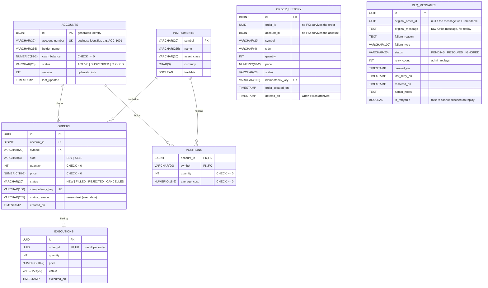

# Trade Database ER Diagram

The operational schema in PostgreSQL, as created by `db/tables` (loaded by the
`db/` image). GitHub renders the diagram below.

## Notes

- **Normalisation.** Each table describes one thing (3NF): instrument details
  live only in `instruments`, account details only in `accounts`, and
  `orders`/`positions` refer to them by key. `positions` uses the natural
  composite key `(account_id, symbol)`.
- **Audit trail.** Every order is kept in `orders`, including `REJECTED` ones;
  the reason a live order failed is recorded in `dlq_messages`. Accounts are closed (`status = CLOSED`), not deleted,
  so their orders stay valid. `order_history` keeps an archived copy of each
  cancelled order without foreign keys.
- **Historical data.** `executions` records the fill for each filled order;
  `orders.created_on` and `executions.executed_on` are indexed for date-range
  queries.
- **Failed messages.** `dlq_messages` is independent of the trading tables: it
  stores Kafka order messages that could not be processed, for an admin to
  replay or dismiss.
- **Reporting.** The views in `db/views` (`v_positions_detail`,
  `v_order_history`, `v_account_summary`) join these tables for dashboards. The
  ETL pipeline loads a star schema into the separate `analytics` schema
  (`dim_account`, `dim_instrument`, `dim_date`, `fact_trades`, plus
  `etl_rejected_orders`); see `etl/schema.sql`.
